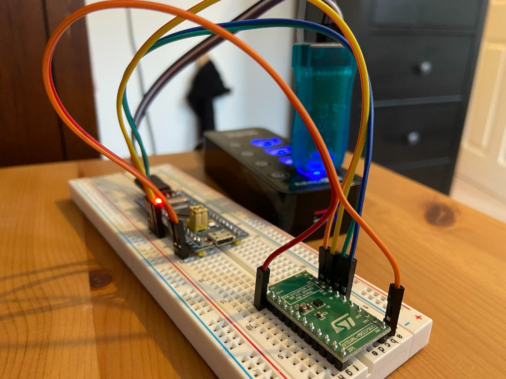

# Accelerometer Tester
Testing the `LIS2DW12` accelerometer in Rust

## Setup

The following hardware is used:

- STM32 bluepill (an STM32F103C8T6 MCU).
- ST-LINK-V2 for programming and debug logging
- STEVAL-MKI179V1 evaluation board which exposes the the `LIS2DW12` sensor

You will need [`probe-run`](https://ferrous-systems.com/blog/probe-run/) which is a utility to enable `cargo run` to run embedded applications on a device:

```
cargo install probe-run
```



Connect the following pins for SPI:
```
Bluepill -> STEVAL-MKI179V1 Eval board:

A7  -> SDA  (MOSI)
A6  -> SAO  (MISO)
A5  -> SCL  (Clock)
A4  -> CS   (Chip Select)
3.3 -> VDD  (3.3v power)
G   -> GND  (Ground)
```

## Running

```
cargo run
```

You should see output like this:
```
bla@blabla:~/source/accelerometer-test$ cargo run
    Finished dev [optimized + debuginfo] target(s) in 0.02s
     Running `probe-run --chip STM32F103CB target/thumbv7m-none-eabi/debug/accelerometer-test`
  (HOST) INFO  flashing program (47.65 KiB)
  (HOST) INFO  success!
────────────────────────────────────────────────────────────────────────────────
[INF] Initializing
[INF] Done initialising
norm: (0.10, -0.14, 3.89), sample_rate_hz: 100, raw: I16x3 { x: 396, y: -552, z: 15568 }
norm: (0.09, -0.14, 3.90), sample_rate_hz: 100, raw: I16x3 { x: 376, y: -544, z: 15592 }
norm: (0.10, -0.13, 3.89), sample_rate_hz: 100, raw: I16x3 { x: 396, y: -532, z: 15572 }
norm: (0.10, -0.14, 3.90), sample_rate_hz: 100, raw: I16x3 { x: 400, y: -552, z: 15600 }
norm: (0.11, -0.14, 3.90), sample_rate_hz: 100, raw: I16x3 { x: 424, y: -564, z: 15584 }
norm: (0.10, -0.14, 3.89), sample_rate_hz: 100, raw: I16x3 { x: 416, y: -564, z: 15560 }
```